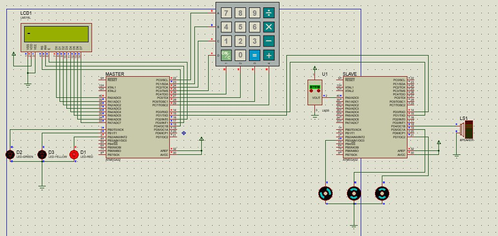

# Server Temperature Control System with Atmega32

This project implements a **server temperature monitoring and control system** using two Atmega32 microcontrollers: a Master (User Interface Unit) and a Slave (Control Unit). The system manages three cooling motors based on real-time temperature input, ensuring effective thermal management in a server environment.

The Master MCU handles password authentication, user interaction via keypad and LCD, and displays system status. The Slave MCU reads temperature, manages motor speeds using PWM based on temperature, detects motor faults, and reports back to the Master. Communication between the units is encrypted for added security.

## 🔧 Simulation 

  

## Key Features
- **Password-Protected Access**: User must enter the correct password via keypad; system locks for 30 seconds after 3 failed attempts.
- **Encrypted Communication**: AES encryption secures messages between Master and Slave.
- **Dynamic Motor Control**: Duty cycle of each motor scales with temperature (e.g., 30% at 30°C).
- **Fault Tolerance Logic**:
  - If 1 motor fails → duty distributed between 2 motors
  - If 2 motors fail → full duty on remaining motor
  - If all fail → system enters **critical error** state
- **Alarm Activation**: Audible alert on system-critical failure.
- **User Interface**: LCD menus show temperature, motor duty cycles, and failure states.
- 🟢🟡🔴 **LED Status Indicator**: Green = OK, Yellow = Partial failure, Red = Critical failure

## Hardware
- 2 × Atmega32 Microcontrollers
- LCD 16x2
- Keypad (4×4)
- 3 × Motors (PWM controlled)
- LM35 Temperature Sensor
- Status LEDs
- Buzzer or Speaker (for alarm)

